# AWS DynamoDB – Student Management

A simple AWS DynamoDB project to manage student data using Create, Read, Update, and Delete operations.

## Project Overview

This project demonstrates basic student data management using **Amazon DynamoDB** and the **AWS Management Console**.

## AWS Service Used

- Amazon DynamoDB
- AWS Management Console

## DynamoDB Table

**Table Name:** `student-management`

**Partition Key:** `Student-ID`

| Attribute | Type | Key |
|---|---|---|
| Student-ID | String | Partition Key |
| Student-Name | String | - |
| Course | String | - |
| City | String | - |
| Age | Number | - |

## Operations Performed

### 1. Create Table

Created the `student-management` DynamoDB table with `Student-ID` as the partition key.

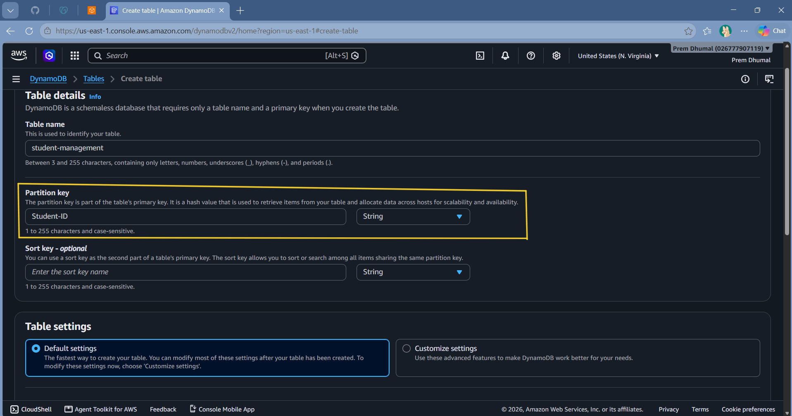

### 2. Table Created

The DynamoDB table was created successfully.

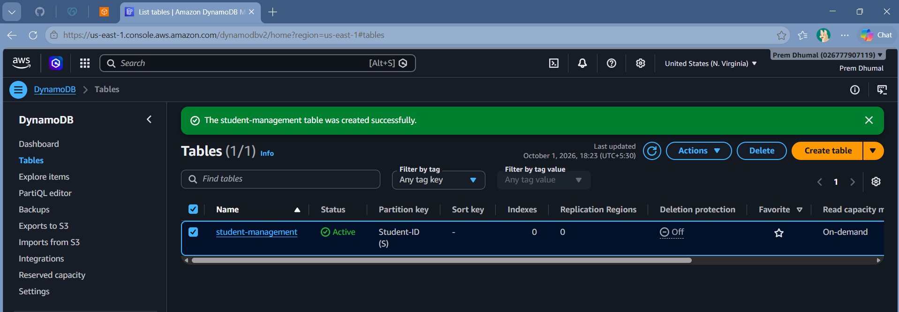

### 3. Create Student Record

Added student data to the DynamoDB table.

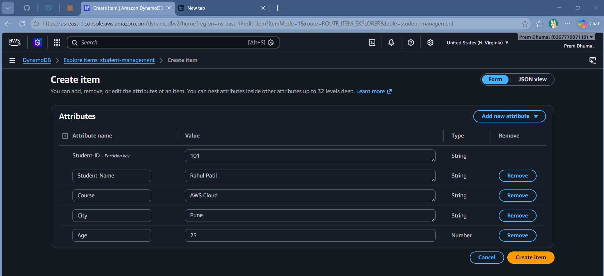

### 4. View Student Records

Viewed the student records stored in the table.

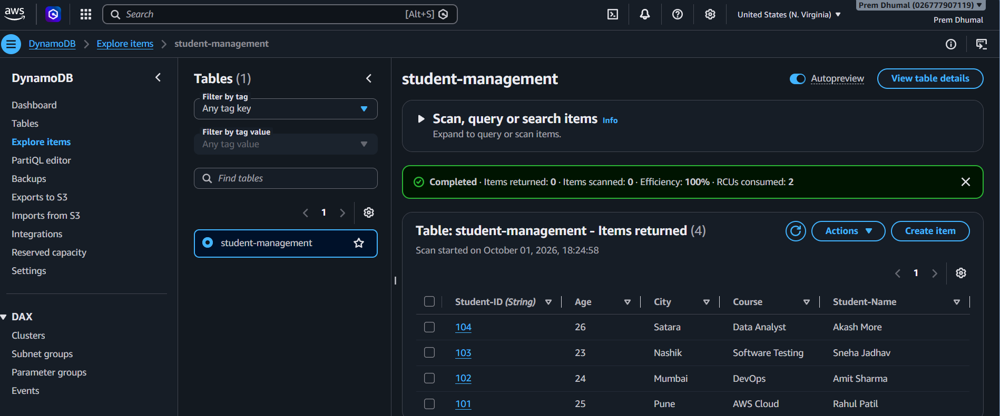

### 5. Retrieve a Student

Entered the `Student-ID` to retrieve a specific student record.

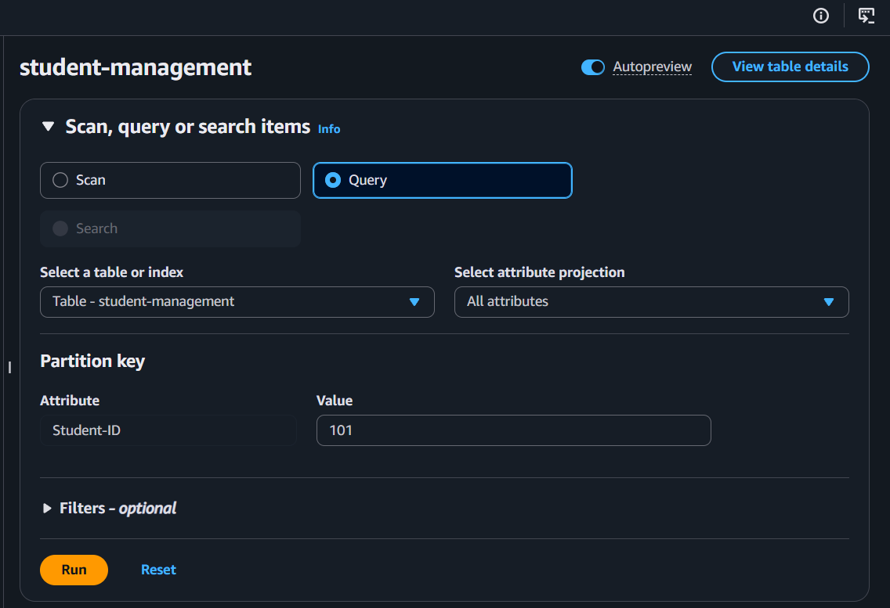

### 6. Query Result

The selected student record was retrieved successfully.

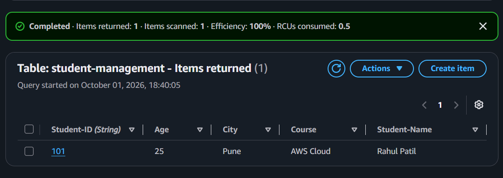

### 7. Before Update

Opened the student record before making changes.

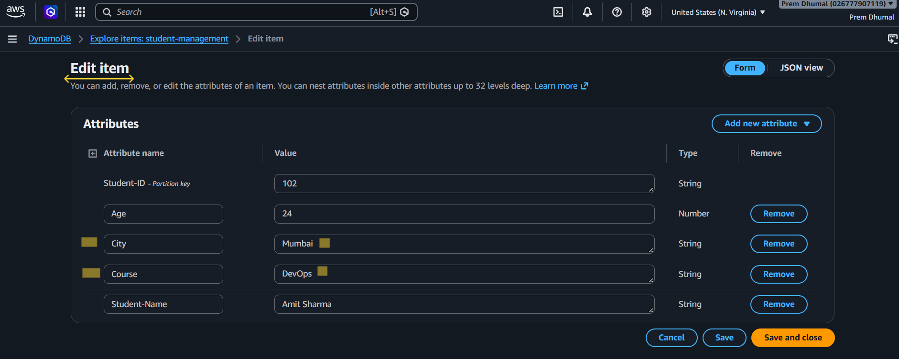

### 8. After Update

Updated the student record and verified the changed values.

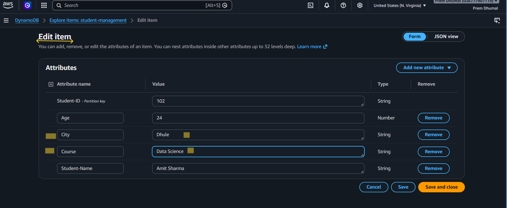

### 9. Delete Student Record

Selected the delete option for the student record.

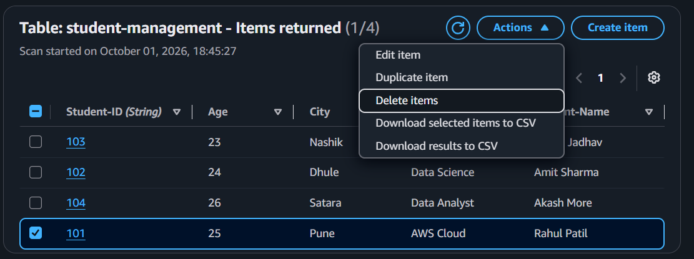

### 10. Final Verification

Checked the table after deletion and verified the remaining records.

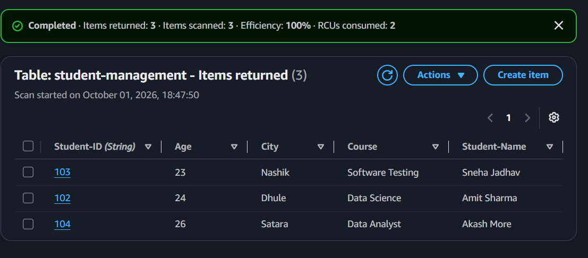

## Architecture Diagram

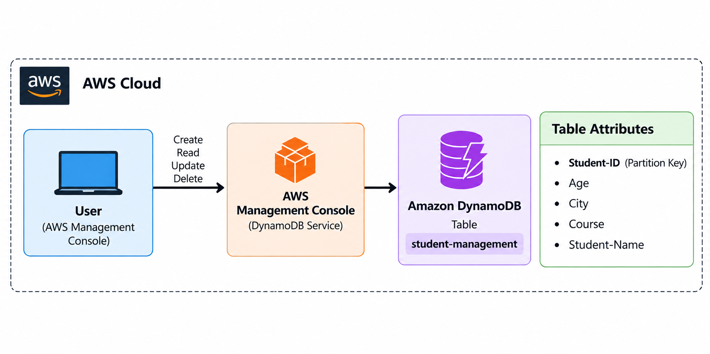

## Project Structure

```text
aws-dynamodb-student-management/
│
├── README.md
├── architecture-diagram.png
│
└── screenshots/
    ├── 01_Create_DynamoDB_Table.png
    ├── 02_Table_Created.png
    ├── 03_Create_Student_Record.png
    ├── 04_All_Student_Records.png
    ├── 05_Query_Input.png
    ├── 06_Query_Result.png
    ├── 07_Before_Update.png
    ├── 08_After_Update.png
    ├── 09_Delete_Action.png
    └── 10_Final_Table_After_Delete.png
```

## Hands-on Learning

This project gave me practical hands-on experience with **Amazon DynamoDB**.

During this practical, I learned:

- What DynamoDB is and where it can be used.
- How to create a DynamoDB table.
- How to set a partition key.
- How to add and view student data.
- How to retrieve a specific record.
- How to update existing data.
- How to delete a record.
- How to verify the data after each operation.
- How to use DynamoDB through the AWS Management Console.

This practical helped me understand how **DynamoDB stores and manages NoSQL data** and how basic data operations are performed in AWS.
